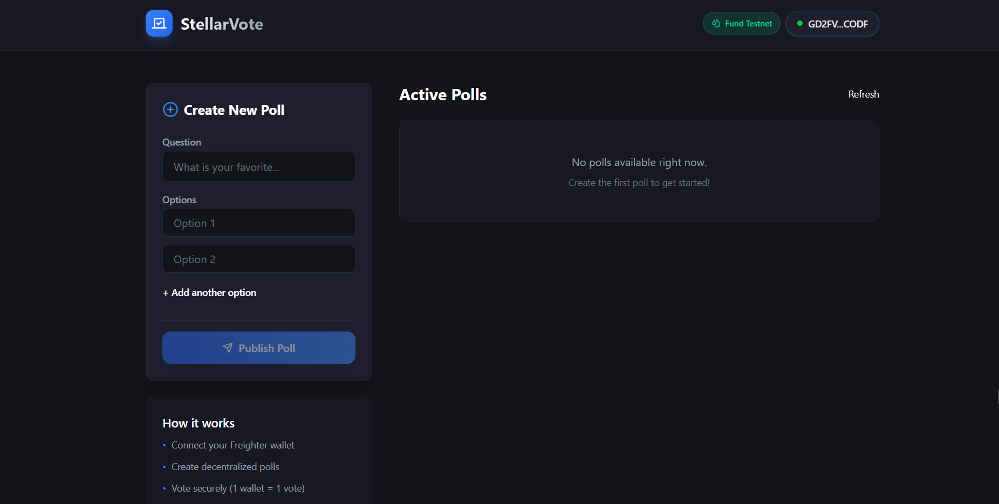
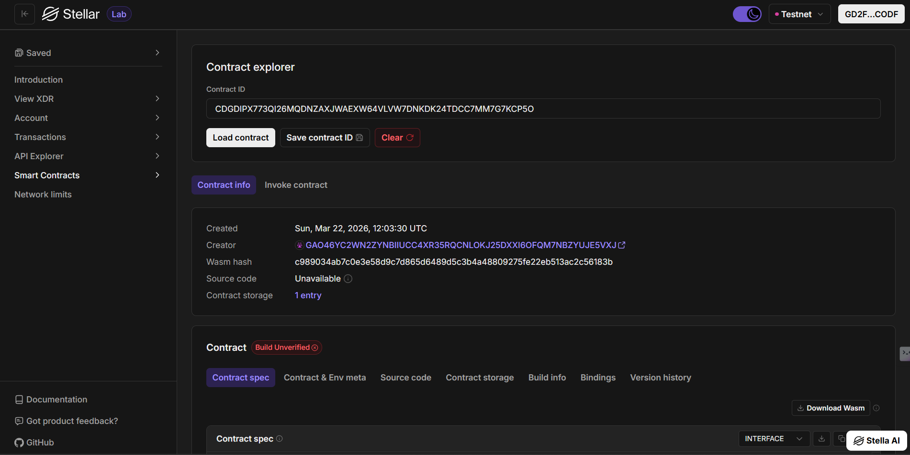

# StellarVote 🗳️

A fully functional, decentralized Web3 voting application built on the Stellar Soroban blockchain. This dApp allows users to create transparent polls and cast secure votes, featuring a premium glassmorphic frontend and an optimized Rust smart contract.

## Deployment Details

*   **Voting Contract ID:** `CDSUVGMRJIOUGEQTSHDUQDZZRX3RRRATIRMLN6WWX7QQK3LDDNYDSSJK`
*   **Hello World Contract ID:** `CB6PTH3TE2CL35IWGGP2MFQSEMATW66I44BF5SWGR3O2GL4CPWDIAJO2`
*   **Network:** Stellar Testnet
*   **On-Chain Verification (Voting):** [View on Stellar Laboratory](https://laboratory.stellar.org/#explorer?resource=contracts&endpoint=details&values=eyJwYXJhbXMiOnsiYWRkcmVzcyI6IkNEU1VWR01SSklPVUdFUVRTSERVUURaWlJYM1JSUkFUSVJNTjZXV1g3UVFLM0xER05ZRFNTSkIifSwibmV0d29yayI6InRlc3RuZXQifQ%3D%3D)

## Dashboard Preview



## On-Chain Verification



## Features ✨

*   **Non-Custodial Wallet Integration:** Securely connect and sign transactions using the [Freighter Browser Extension](https://www.freighter.app/).
*   **Decentralized Polls:** Anyone can create a poll that is stored permanently on the Stellar ledger.
*   **Secure Voting (1 Wallet = 1 Vote):** The smart contract enforces unique voting, preventing double-voting and ensuring integrity.
*   **Real-time Ledger Dashboard:** View active polls and live result counts fetched directly from the Soroban RPC.
*   **Premium Glassmorphic UI:** A beautiful, responsive frontend built with React, Vite, and Vanilla CSS with modern aesthetics.

## Project Architecture 🏗️

The project is structured to follow standard Soroban development patterns:

1.  **Smart Contract (`/contracts/voting`)**: Written in Rust using the Soroban SDK. Handles poll creation, vote counting, and state persistence.
2.  **Frontend (`/frontend`)**: A React + Vite Web3 application using TypeScript and the `@stellar/stellar-sdk` to interact with the blockchain.

---

## Getting Started 🚀

### Prerequisites

*   [Node.js](https://nodejs.org/) (v18+)
*   [Rust & Cargo](https://www.rust-lang.org/tools/install)
*   [Stellar CLI](https://developers.stellar.org/docs/tools/stellar-cli/install)
*   [Freighter Wallet Extension](https://www.freighter.app/)

### 1. Smart Contract Automation

The project includes a root-level `Makefile` and `package.json` to automate typical tasks:

*   **Build Contract:** `npm run build:contract`
*   **Run Tests:** `npm run test:contract`
*   **Deploy:** `npm run deploy:contract` (requires identity configuration)
*   **Generate Bindings:** `npm run gen-bindings`

### 2. Frontend Application

1. **Install dependencies:**
   ```bash
   npm install
   ```
2. **Start the development server:**
   ```bash
   npm run dev
   ```
3. **Open your browser:** `http://localhost:5173`

### Connecting your Wallet

1. Install the [Freighter extension](https://www.freighter.app/).
2. Switch to the **Testnet** network in Freighter settings.
3. Fund your wallet using the [Friendbot](https://laboratory.stellar.org/#account-creator?network=test).
4. Click **Connect Wallet** in the StellarVote dashboard.
